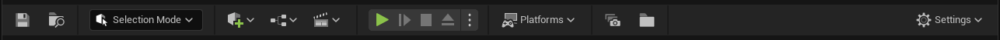
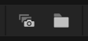

# How to use

AutoCapture was built to help capture editor screenshot in bulk. The tool finds all of the camera actors (both regular and cinematic) and takes a screen shot of all of them.
Besides manual capture the tool also supports automatic captures. This feature works similarly to the editor's Auto Save functionality.

## Toolbar buttons

On the main toolbar next to the _"Platforms"_ drop menu, the plugin adds two new buttons that are the main interaction points for the tool.

{loading=lazy, align=right}

- Capture all cameras _(on the left)_
- Open capture folder _(on the right)_

## Manual capture

To create captures manually, you just have to use the **Capture All Cameras** button on the main toolbar.

When clicked, the tool will find all of the **Visible** camera actors in the scene. If a visibility for a camera is toggled off _(Eye icon in the Outliner)_, the camera won't be captured.

After all of the cameras are gathered, the tool will loop over them one by one, momentarily pilots it takes a captures, based on the tool settings.

When all of the cameras been captured, the viewport will return to the last position before the capture was initiated.

## Automatic Capture

When the _Enable AutoCapture_ option is enable on the settings page, a batch of screenshots will be taken based on the settings.

### Only show reminder

The tool is capable to only show a reminder notification every so often. When the _Only Show Notification_ option is enabled, the screenshot process won't kick in, and only a notification will be shown after the preset time.

## Open Capture Folder button

When this is clicked, the capture folder will be opened the operating systems file explorer.

If the Output folder path wasn't set in the settings page, the default Unreal capture folder will be opened.
