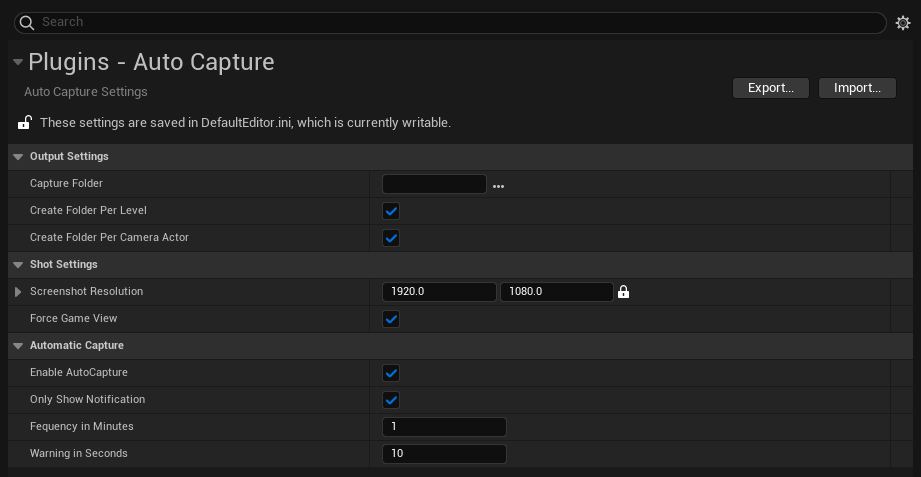

# Settings

The plugin adds a setting page that give access to output, capture and automatic capture settings. These can be found under **Project Settings -> Plugins -> Auto Capture** page.

{loading=lazy}

## Output Settings

These settings responsible for the folder structure of the captured images.

### Capture Folder

The folder where the captures will be stored. If left _empty_ Unreal's default location will be used.

### Create Folder Per Level

When enabled, the tool will crate a folder for each level that you've been working on. This can be useful for example if you are working on an environment, but also have an asset gym level.

### Create Folder Per Camera Actor

When enabled, the tool will create a folder for each camera actor in the scene. This can be used together with the _Create Folder Per Level_ feature.

## Shot Settings

These settings control each capture that gets taken.

### Screenshot Resolution

The base resolution of the screenshot. If the camera actors aspect ratio is different from this, the larger side will be used as the default scale and the small side will be scaled according to the cameras aspect ration. _(For example if the resolution is set to be 1920x1080 (16:9), but the camera is set to be 3:4 then the capture will be taken as 810:1080)_

### Force Game View

When enabled, the viewport will be force to be switched over to **Game View** _(shortcut G)_. When all of the captures are taken, the original state will be reverted.

## Automatic Capture

### Enable AutoCapture

When enabled, based on the Capture frequency, the editor will automatically take a set of screenshot of the current level.

### Only Show Notification

When enabled, a reminder will be shown in the bottom right corner of the editor, but not capture will be taken.

### Frequency in Minutes

If the _Enable AutoCapture_ option is enable, a capture will be taken based on this interval. When the _Only Show Notification_ option is enabled, this time will be used for reminders too.

### Warning in Seconds

This option controls the amount of time before the capture is taken. Based on this time, a countdown will be show on the bottom right corner of the editor.
